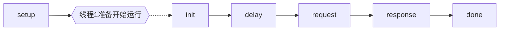

# WRK Lua 扩充接口

wrk支持在三个不同的阶段执行LuaJIT脚本：设置（setup）、运行（running）和完成（done）。

每个wrk线程对应一个独立的脚本环境，设置（setup）和完成（done）阶段运行环境是独立的，和运行（running）阶段的运行环境不同。


## 全局概览

开放的 Lua API 包含一个全局table `wrk`和若干的全局函数。

- 全局table `wrk`

```json
  wrk = {
    scheme  = "http",
    host    = "localhost",
    port    = nil,
    method  = "GET",
    path    = "/",
    headers = {},
    body    = nil,
    thread  = <userdata>,
  }
```

- function wrk.format(method, path, headers, body)

wrk.format 函数返回一个HTTP请求字符串， 它是wrk表的内容，再合并传进去的指定参数而获得的。

- function wrk.lookup(host, service)

wrk.lookup 返回一个table，包含指定`host`和`service(或者端口)`组对应的所有地址。等同于POSIX系统里的getaddrinfo() 函数。

- function wrk.connect(addr)

wrk.connect 返回 true 如果address地址可以连上，否则为false。address 地址必须是wrk.lookup() 返回的对象。


以下全局变量是可以选的，他们必须被定义为函数functions：

  - global setup    -- 在线程创建时被调用；
  - global init     -- 在线程开始时被调用；
  - global delay    -- 获得请求延时；
  - global request  -- 产生 HTTP request；
  - global response -- 获得 HTTP response 数据后的处理；
  - global done     -- 运行结束后，获得结果的调用。  

## 设置阶段

- function setup(thread)

设置（setup）阶段处于目标IP地址已经解析好了，所有的线程都初始化好了，但线程还没有正式开始工作之前。

每个线程都会调用一次setup()函数，并收到一个该线程对应的`userdata`对象。

  - thread.addr               - get 或者 set 该线程的服务器地址
  - thread:get(name)        - get 在当前线程的环境里，`name`变量的值
  - thread:set(name, value) - set 在当前线程环境里，设置`name`变量的值`value`
  - thread:stop()           - stop 停止当前线程

通过get()/set() 传进传出的值，只能为boolean, nil, number和string类型（存疑： or tables of the same？啥意思），而 thread:stop() 只能在线程运行时被调用。

## 运行阶段

运行阶段有以下函数：

-  function init(args)
-  function delay()
-  function request()
-  function response(status, headers, body)

在运行阶段，首先会总体地执行一次init()调用，然后在每个请求周期里，再调用一次 request() 和 response()。

init() 函数会接收通过wrk命令执行，以 `--`分隔符传入的额外参数。

delay() 会返回发给下一个请求的延迟毫秒数。

request() 会返回包含当前 HTTP 请求的字符串。每次都创建一个新的请求会很花时间，在高强度压力测试下，最好是在init()里预先创建好所有请求，然后在request里快速获取预制的请求即可。

调用 response() 可以获得HTTP 响应状态、响应头和响应体。解析响应头和响应体也很花时间，所以如果init()执行后，全局response是nil，那后续wrk会忽略这里的响应头和响应体。

## 完成阶段

- function done(summary, latency, requests)

  The done() function receives a table containing result data, and two
  statistics objects representing the per-request latency and per-thread
  request rate. Duration and latency are microsecond values and rate is
  measured in requests per second.

  latency.min              -- minimum value seen
  latency.max              -- maximum value seen
  latency.mean             -- average value seen
  latency.stdev            -- standard deviation
  latency:percentile(99.0) -- 99th percentile value
  latency(i)               -- raw value and count

  summary = {
    duration = N,  -- run duration in microseconds
    requests = N,  -- total completed requests
    bytes    = N,  -- total bytes received
    errors   = {
      connect = N, -- total socket connection errors
      read    = N, -- total socket read errors
      write   = N, -- total socket write errors
      status  = N, -- total HTTP status codes > 399
      timeout = N  -- total request timeouts
    }
  }
